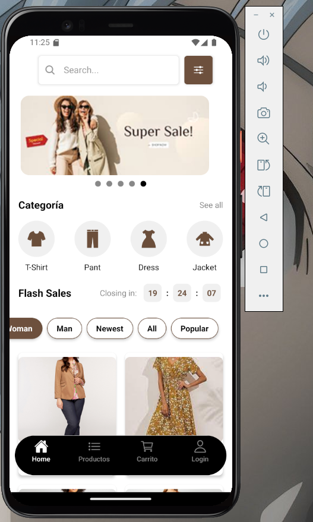

#Componentes principales


#ecommerce los siguientes componentes principales:





Barra de navegación (Navigation Bar):

Contiene el logo de la tienda.
Botones de navegación (New Collection, Category, etc.).
Icono de búsqueda.
Ubicación (New York, USA).
Banner principal (Hero Banner):

Imagen de alta calidad del producto o promoción principal.
Texto llamativo (Discount 50% for the first transaction).
Botón de llamada a la acción (Shop Now).

Categorías (Categories):

Lista de categorías de productos (T-Shirt, Pant, Dress, etc.).
Enlace para ver todas las categorías (See All).
Venta flash (Flash Sale):

Título de la sección (Flash Sale).
Temporizador de cuenta regresiva (Closing in: 02:12:56).
Vista previa de productos en oferta (Light Brown Jacket).
Lista de productos (Product List):

Muestra una lista de productos con imágenes, nombres y precios.
Opciones para filtrar y ordenar productos (All, Newest, Popular).
Detalles del producto (Product Details):

Imágenes del producto.
Nombre y descripción del producto (Light Brown Jacket, Lorem ipsum...).
Opciones de tamaño (Select Size).
Opciones de color (Select Color).
Precio total (Total Price).
Botón para añadir al carrito (Add to Cart).
Tecnologías recomendadas
React Native: Para construir la aplicación móvil.
Expo: Para facilitar el desarrollo y despliegue de la aplicación.
Componentes de React Native: Para crear la interfaz de usuario.
Estilos con CSS o Styled Components: Para dar estilo a la aplicación.
Navegación con React Navigation: Para permitir la navegación entre pantallas.
Gestión de estado con Redux o Context API: Para gestionar los datos de la aplicación.
Librerías para peticiones HTTP (Axios o Fetch API): Para comunicarte con un servidor y obtener los datos de los productos.
Base de datos (Firebase, Supabase, etc.): Para almacenar los datos de los productos, usuarios y pedidos.
Pasos para construir tu ecommerce
Planificación: Define las funcionalidades de tu ecommerce, las pantallas que necesitarás y cómo se organizarán los datos.


Integración: Conecta con una base de datos y un servidor para obtener los datos de los productos y gestionar los pedidos.


front_onsolution/
├── App.js             // Componente principal de la aplicación
├── index.js  
├── Routes.js          // Configuración de rutas y navegación
├── components/        // Componentes reutilizables
│   ├── NavigationBar.js   // Barra de navegación inferior
│   ├── Layout.js        // Diseño general de las pantallas
│   └── ... otros componentes
├── screens/           // Componentes de las pantallas
│   ├── HomeScreen.js    // Pantalla de inicio
│   ├── DetailsScreen.js // Pantalla de detalles
│   ├── InicioScreen.js   // Pantalla de inicio (ejemplo)
│   ├── ProductosScreen.js// Pantalla de productos (ejemplo)
│   ├── CarritoScreen.js // Pantalla de carrito (ejemplo)
│   └── ... otras pantallas
├── assets/            // Recursos estáticos (imágenes, iconos)
├── ├── icons         // 
│   ├── img           // 
│   └── ... otras imagenes
├── data.json


<br />

## ✨ Code-base structure

El proyecto viene con una estructura sencilla e intuitiva que se presenta a continuación:
                                                                
```bash
< PROJECT ROOT PUNTO DE VENTA>
   |
   |-- data/                               # 
   |    |-- env/                           # 
   |
   |-- media/                              # 
   |    |-- icons/                         # 
   |         |-- img_productos/            # 
   |         |-- fondo.png                 #   
   |
   |-- modulos/                            #
   |    |
   |    |-- login/                         # 
   |    |-- clientes.py                    # 
   |    |-- informacion.py                 #  
   |    |-- inventario.py                  #   
   |    |-- pedidos.py                     # 
   |    |-- proveedor.py                   #
   |    |-- ventas.py                      #
   |
   |-- requirements.txt                    # 
   |-- .gitignore   
   |-- container.py                        # 
   |-- index.py                            # 
   |-- LICENSE                             # 
   |-- manager.py                          # 
   |-- readme.md                           # 
   |
   |-- ************************************************************************
```

<br />
              